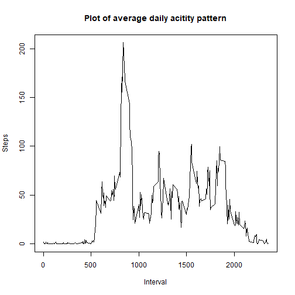

## Loading and preprocessing the data


```r
# load relevant libraries
library(dplyr)
library(lattice)

# download data
download.file("https://d396qusza40orc.cloudfront.net/repdata%2Fdata%2Factivity.zip", "Dataset.zip", method = "curl")
unzip("Dataset.zip")
activity <- read.csv("activity.csv")

# remove NA records
df <- activity[!is.na(activity$steps),]

# format date
df$date <- as.Date(df$date, "%Y-%m-%d")
```


## What is mean total number of steps taken per day?

```r
# group by day
df.by_date <- df %>%
              group_by(date) %>% 
              summarize(
                steps = sum(steps)
              )

# draw histogram
hist(df.by_date$steps, main = "Histogram of total number of steps taken per day", breaks = 10, xlab = "Steps")
```


```r
# calculate mean of daily total steps
mean(df.by_date$steps)
```

```
## [1] 10766.19
```

```r
# calculate median of daily total steps
median(df.by_date$steps)
```

```
## [1] 10765
```


## What is the average daily activity pattern?

```r
# group by interval
df.by_interval <- df %>%
                  group_by(interval) %>% 
                  summarize(
                     steps = mean(steps)
                  )

# draw plot
plot(df.by_interval$interval, df.by_interval$steps, main = "Plot of average daily acitity pattern", xlab = "Interval", ylab = "Steps", type = "l")
```



```r
# show interval with most steps
subset(df.by_interval, df.by_interval$steps == max(df.by_interval$steps))
```

```
## # A tibble: 1 x 2
##   interval steps
##      <int> <dbl>
## 1      835  206.
```


## Imputing missing values

```r
# show number of NA records
print(paste("Number of NA records:", nrow(activity[is.na(activity$steps),])))
```

```
## [1] "Number of NA records: 2304"
```

```r
# Extract NA rows
df.NA <- activity[is.na(activity$steps),]

# inner join NA values with average values by interval
df.subst <- merge(df.NA, df.by_interval, by = "interval")[,c(1,4,3)]

# update column names of df.subst
names(df.subst) <- c("interval", "steps", "date")

# merge dataframe with substituted NA values and original dataframe without NA values  
df.subst <- rbind(df, df.subst)

## Calculate data and display histogram
# group by day
df.subst.by_date <- df.subst %>%
                    group_by(date) %>% 
                    summarize(
                      steps = sum(steps)
                    )

# draw histogram
hist(df.subst.by_date$steps, main = "Histogram of total number of steps taken per day\n(higher peak between 10k-12k)", breaks = 10, xlab = "Steps")
```


```r
# calculate mean of daily total steps
print(paste("Mean of total daily steps (same result as without NA values):", mean(df.subst.by_date$steps)))
```

```
## [1] "Mean of total daily steps (same result as without NA values): 10766.1886792453"
```

```r
# calculate median of daily total steps
print(paste("Median of total daily steps (same as mean):", median(df.subst.by_date$steps)))
```

```
## [1] "Median of total daily steps (same as mean): 10766.1886792453"
```


## Are there differences in activity patterns between weekdays and weekends?

```r
# Add column with indication whether a day is a weekday or weekend to the dataframe 
df.daytype <- df.subst %>%
  mutate(DayType = c("weekend", "weekday", "weekday", "weekday", "weekday", "weekday", "weekend")[as.POSIXlt(date)$wday + 1])

# Convert new column to factor column
df.daytype$DayType <- as.factor(df.daytype$DayType)

# group by interval
df.daytype.by_interval <- df.daytype %>%
                          group_by(interval, DayType) %>% 
                          summarize(
                            steps = mean(steps)
                          )
```

```
## `summarise()` has grouped output by 'interval'. You can override using the `.groups` argument.
```

```r
with(df.daytype.by_interval, xyplot(steps ~ interval | DayType, type = "l", xlab = "Interval", ylab = "Number of steps", layout = c(1,2)))
```


